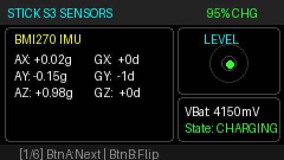
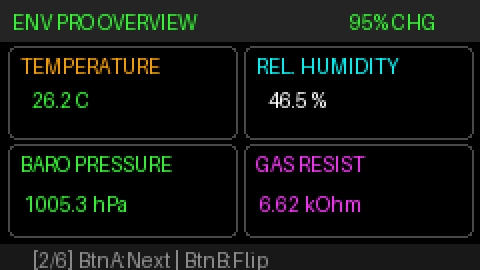
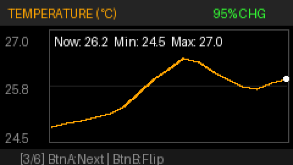
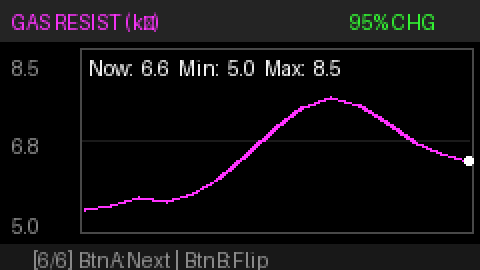

# sticks3-ENV-pro-tool

[](https://www.gnu.org/licenses/gpl-3.0)
[](#version-20-native-matter-smart-home-firmware)
[](https://www.python.org/)
[](https://docs.m5stack.com/en/core/StickS3)
[-purple.svg)](https://docs.m5stack.com/en/unit/env_pro)

A real-time environmental monitoring suite, historical logger, time-series charting engine, and **Matter-over-Wi-Fi Smart Home device** for the **M5Stack StickS3** (ESP32-S3) with an attached **Unit ENV Pro** (Bosch BME688) over Grove I2C.

This repository provides two complete operating tracks:
1. **Version 1.0 (MicroPython / UIFlow 2.0)**: On-device dashboard app with background logging and UIFlow 2 App List integration.
2. **Version 2.0 (Native C++ Matter Firmware)**: Native Matter-over-Wi-Fi device exposing standard smart home temperature, humidity, and pressure endpoints to **Apple Home**, **Google Home**, **Amazon Alexa**, and **Home Assistant**, featuring an on-screen pairing QR code.

---

## UI Preview & Screenshots

| 1. Stick S3 IMU & Spirit Level | 2. ENV Pro Live Overview |
|:---:|:---:|
|  |  |
| *BMI270 6-axis IMU, live spirit level crosshair, and battery monitor* | *Live numerical tiles for Temperature, Humidity, Pressure, and Gas* |

| 3. Temperature Historical Chart | 4. Gas Resistance / VOC Chart |
|:---:|:---:|
|  |  |
| *Auto-scaled temperature trend line with live, min, and max readouts* | *Indoor air quality / VOC indicator tracking over time* |

---

## Hardware Requirements & Pinout

| Component | Hardware Details | Connection / Pins |
| :--- | :--- | :--- |
| **Host Device** | M5Stack StickS3 (ESP32-S3) | USB-C |
| **Display** | 1.14" IPS LCD (240 × 135 px, ST7789v2) | Internal SPI |
| **Internal IMU** | Bosch BMI270 (6-axis Accelerometer & Gyroscope) | Internal I2C |
| **External Sensor** | M5Stack Unit ENV Pro (Bosch BME688) | Grove Port A (I2C: SDA=GPIO 9, SCL=GPIO 10, Addr=0x77) |
| **Grove Power** | AW35122 5V Boost Converter | Enabled via `M5.Power.setExtOutput(true)` |

> [!IMPORTANT]
> The Grove 5V rail on StickS3 is powered off by default. Both the MicroPython and C++ firmware explicitly enable `M5.Power.setExtOutput(true)` to power the Unit ENV Pro.

---

## Version 2.0: Native Matter Smart Home Firmware

Version 2.0 transforms your M5StickS3 + Unit ENV Pro into a certified-compliant **Matter-over-Wi-Fi** environmental sensor for Apple Home, Google Home, Amazon Alexa, Samsung SmartThings, and Home Assistant.

### Matter Capabilities & Endpoints
- **Temperature Sensor (`0x0402`)**: Continuous real-time temperature telemetry in 0.01 °C resolution.
- **Relative Humidity Sensor (`0x0405`)**: 0 to 100 %RH measurement.
- **Pressure Sensor (`0x0403`)**: Barometric pressure reporting in hPa.
- **BLE Commissioning**: Standard Matter Bluetooth Low Energy onboarding with Apple/Google/Home Assistant apps.
- **On-Screen Commissioning QR Code**: The 7th display carousel view renders the official Matter QR code directly on the StickS3 LCD screen for instant camera scanning.
- **Manual Pairing Code**: Displays standard Matter pairing code `3497-011-2332`.
- **Dual Factory Reset**:
  - Hold **Button A** for 10 seconds while on Screen 7 (features an on-screen 3-second countdown).
  - Or run `./manage-v2.sh matter-reset` from your terminal.

### Quick Start: Building & Flashing Version 2.0
The repository includes `./manage-v2.sh` which manages a standalone, non-root `arduino-cli` environment:

```bash
# 1. Setup local toolchain and libraries (one-time)
./manage-v2.sh setup

# 2. Compile native Matter firmware
./manage-v2.sh compile

# 3. Flash to connected StickS3
./manage-v2.sh flash

# 4. Open serial monitor to observe Matter events
./manage-v2.sh monitor
```

### Commissioning Steps
1. Power on the flashed StickS3. Use **Button A** to cycle to **Screen 7 (MATTER STATUS)**.
2. Open **Apple Home**, **Google Home**, or **Home Assistant** on your mobile phone.
3. Tap **Add Accessory** $\rightarrow$ **Scan QR Code**.
4. Scan the QR code rendered on the StickS3 LCD screen (or enter manual code `3497-011-2332`).
5. Select your 2.4 GHz Wi-Fi network and assign the sensor to a room.
6. The display updates immediately to show **PAIRED (Fabric OK)** along with your local IP address!

---

## Version 1.0: MicroPython & UIFlow 2.0 Application

Version 1.0 is built for users running MicroPython or UIFlow 2.0 firmware.

### Features
- **6-Screen Carousel**: StickS3 IMU + spirit level, ENV Pro live overview, and 4 time-series trend charts (Temp, Hum, Pressure, Gas Resistance).
- **Background 2s Polling**: Sensor values continue recording into ring buffers even when the display auto-sleeps.
- **Smart Power Saving**: Display sleeps after 30s of inactivity; wakes instantly on button press.
- **UIFlow 2 App Launcher**: Runs as `/apps/sensor_dashboard.py` and cleanly restores orientation upon exit.

### Host Setup & Management
```bash
# Setup Python environment using uv (recommended)
uv sync

# Or using standard python3
python3 -m venv .venv && source .venv/bin/activate && pip install -e .

# Device management
./manage.sh detect           # Detect connected USB port
./manage.sh info             # Hardware & MicroPython details
./manage.sh run              # Run live over serial in RAM
./manage.sh deploy           # Install permanently to flash
./manage.sh set-boot-menu    # Boot to UIFlow 2 startup menu
./manage.sh set-boot-direct  # Boot directly to sensor dashboard
./manage.sh repl             # Open interactive REPL
```

---

## On-Device Controls

| Control | Action | Version 1.0 (MicroPython) | Version 2.0 (Matter C++) |
| :--- | :--- | :--- | :--- |
| **Button A (Front M5)** | Short Press | Cycle 6 screens / Wake | Cycle 7 screens / Wake |
| **Button A (Front M5)** | Long Hold | Exit to UIFlow 2 menu (2.5s) | Matter Factory Reset (10s on Screen 7) |
| **Button B (Side)** | Short Press | Flip screen 180° | Flip screen 180° |
| **Button B (Side)** | Long Hold (>1s) | Toggle display sleep/wake | Toggle display sleep/wake |

---

## License

This project is licensed under the **GNU General Public License v3.0** (GPLv3) — see the [LICENSE](LICENSE) file for details.
